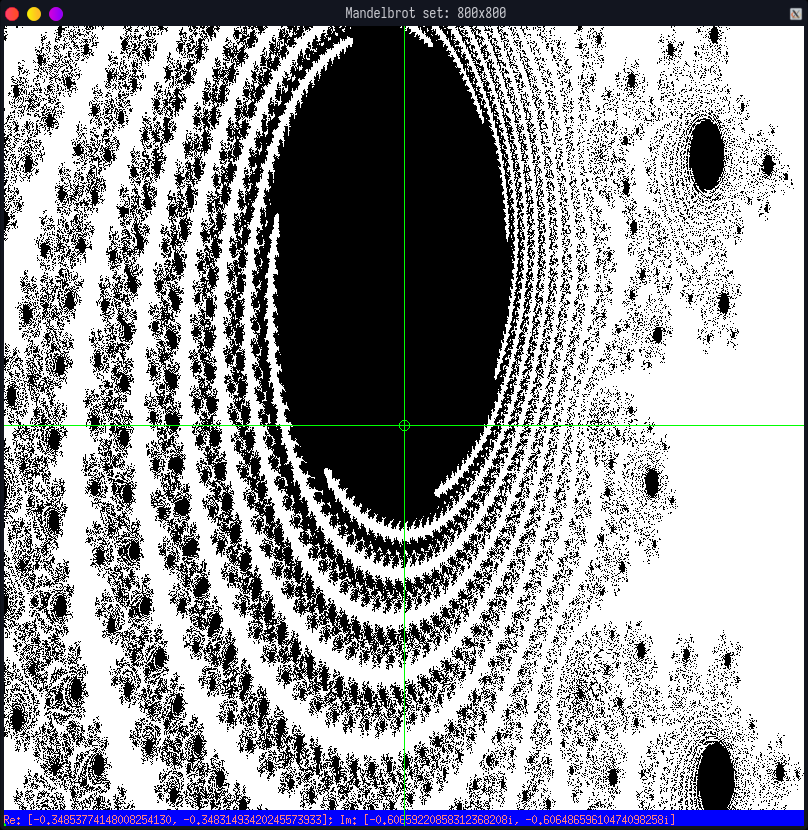
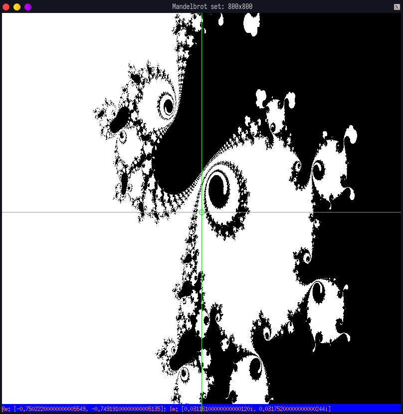

# Mandelbrot set
Mandelbrot set in OCaml

```
λ dune build && dune exec _build/default/bin/main.exe
```


```
λ dune build && _build/default/bin/main.exe -w 800 -h 800 -xa "-0.34853774148008254" -xb "-0.34831493420245574" -ya "-0.6065922085831237" -yb "-0.606486596104741" -l 1200
```



```
λ dune build &&  _build/default/bin/main.exe -w 800 -h 800 -xa "-0.750222" -xb "-0.749191" -ya "0.031161" -yb "0.031752" -l 400
```


