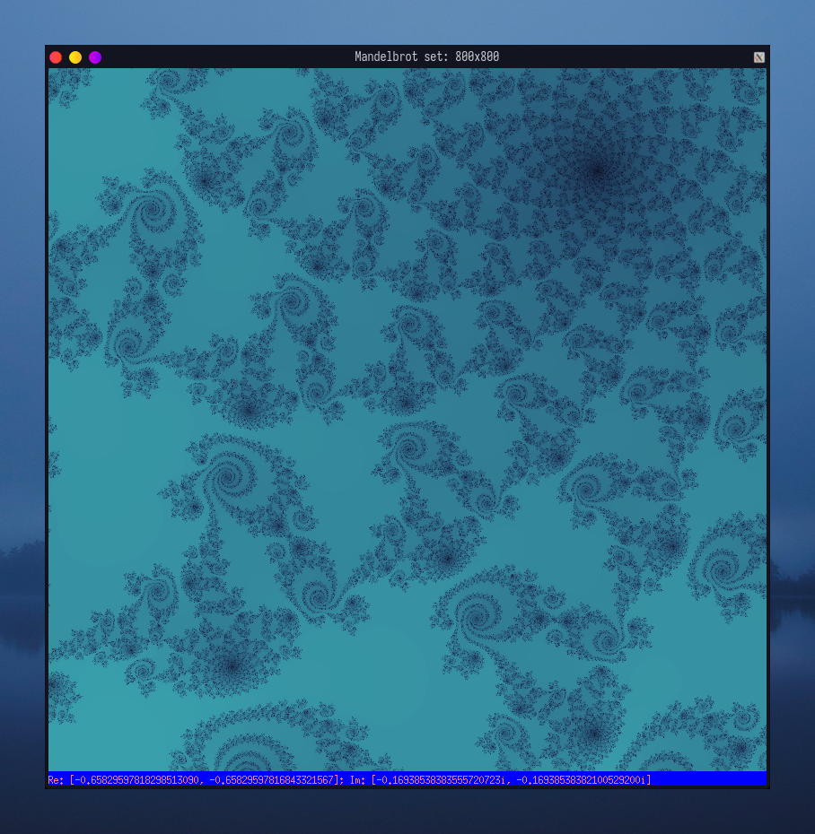

# Mandelbrot set
Mandelbrot set visualizer written in OCaml

```
λ dune build && dune exec _build/default/bin/main.exe
```


## Command line argumets
Available using the `--help` argument
```
λ _build/default/bin/main.exe --help

    mandelbrotset
    -w int
    -h int
    -xa float
    -xb float
    -ya float
    -yb float
    -l int
   
  -w Window width
  -h Window height
  -xa Lower bound of the Real domain
  -xb Upper bound of the Real domain
  -ya Lower bound of the Imaginary domain
  -yb Upper bound of the Imaginary domain
  -l Iterations before the computed function gets {|tired|}
  -help  Display this list of options
  --help  Display this list of options
```


```
λ dune build && _build/default/bin/main.exe -w 800 -h 800 -xa "-0.34853774148008254" -xb "-0.34831493420245574" -ya "-0.6065922085831237" -yb "-0.606486596104741" -l 1200
```


```
λ dune build &&  _build/default/bin/main.exe -w 800 -h 800 -xa "-0.750222" -xb "-0.749191" -ya "0.031161" -yb "0.031752" -l 400
```


```
λ dune build &&  _build/default/bin/main.exe -w 800 -h 800 -xa "-0.65829597818298513090" -xb "-0.65829597816843321567" -ya "-0.16938538383555720723" -yb "-0.16938538382100529200" -l 4000
```


