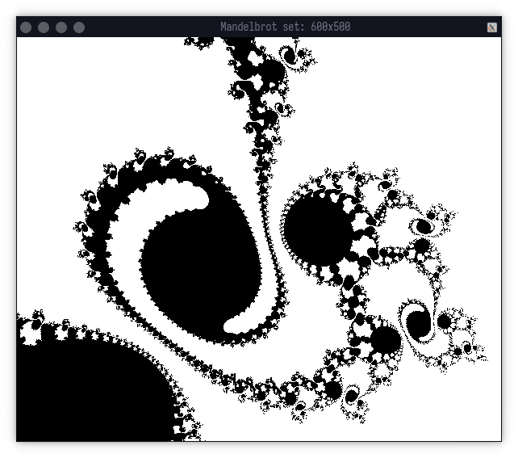

# Mandelbrot set
Mandelbrot set in OCaml

```
$ dune build && dune exec _build/default/bin/main.exe
```



```
$ dune build && dune exec _build/default/bin/main.exe -xa "-0.34853774148008254" -xb "-0.34831493420245574" -ya "-0.6065922085831237" -yb "-0.606486596104741" -s 0.00000005
```
